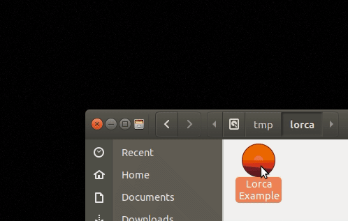

# Lorca

[](https://github.com/zserge/lorca)
[](https://godoc.org/github.com/zserge/lorca)
[](https://goreportcard.com/report/github.com/zserge/lorca)

<div>

<br/>
<p>
	A very small library to build modern HTML5 desktop apps in Go. It uses Chrome
	browser as a UI layer. Unlike Electron it doesn't bundle Chrome into the app
	package, but rather reuses the one that is already installed. Lorca
	establishes a connection to the browser window and allows calling Go code
	from the UI and manipulating UI from Go in a seamless manner.
</p>
<br/>
</div>


## Features

* Pure Go library (no cgo) with a very simple API
* Small application size (normally 5-10MB)
* Best of both worlds - the whole power of HTML/CSS to make your UI look
	good, combined with Go performance and ease of development
* Expose Go functions/methods and call them from JavaScript
* Call arbitrary JavaScript code from Go
* Asynchronous flow between UI and main app in both languages (async/await and Goroutines)
* Supports loading web UI from the local web server or via data URL
* Supports embedding all assets into a single binary
* Supports testing your app with the UI in the headless mode
* Supports multiple app windows
* Supports packaging and branding (e.g. custom app icons). Packaging for all
	three OS can be done on a single machine using GOOS and GOARCH variables.

Also, limitations by design:

* Requires Chrome/Chromium >= 70 to be installed.
* No control over the Chrome window yet (e.g. you can't remove border, make it
	transparent, control position or size).
* No window menu (tray menus and native OS dialogs are still possible via
	3rd-party libraries)

If you want to have more control of the browser window - consider using
[webview](https://github.com/zserge/webview) library with a similar API, so
migration would be smooth.

## Example

```go
ui, _ := lorca.New("", "", 480, 320)
defer ui.Close()

// Bind Go function to be available in JS. Go function may be long-running and
// blocking - in JS it's represented with a Promise.
ui.Bind("add", func(a, b int) int { return a + b })

// Call JS function from Go. Functions may be asynchronous, i.e. return promises
n := ui.Eval(`Math.random()`).Float()
fmt.Println(n)

// Call JS that calls Go and so on and so on...
m := ui.Eval(`add(2, 3)`).Int()
fmt.Println(m)

// Wait for the browser window to be closed
<-ui.Done()
```

<p align="center"></p>

Also, see [examples](examples) for more details about binding functions, embedding
assets and packaging binaries.

## Hello World

Here are the steps to run the hello world example.

```
cd examples/counter
go get
go run ./
```

## How it works

Under the hood Lorca uses [Chrome DevTools Protocol](https://chromedevtools.github.io/devtools-protocol/) to instrument on a Chrome instance. First Lorca tries to locate your installed Chrome, starts a remote debugging instance binding to an ephemeral port and reads from `stderr` for the actual WebSocket endpoint. Then Lorca opens a new client connection to the WebSocket server, and instruments Chrome by sending JSON messages of Chrome DevTools Protocol methods via WebSocket. JavaScript functions are evaluated in Chrome, while Go functions actually run in Go runtime and returned values are sent to Chrome.

## What's in a name?

> There is kind of a legend, that before his execution Garcia Lorca have seen a
> sunrise over the heads of the soldiers and he said "And yet, the sun rises...".
> Probably it was the beginning of a poem. (J. Brodsky)

Lorca is an anagram of [Carlo](https://github.com/GoogleChromeLabs/carlo/), a
project with a similar goal for Node.js.

## License

Code is distributed under MIT license, feel free to use it in your proprietary
projects as well.

